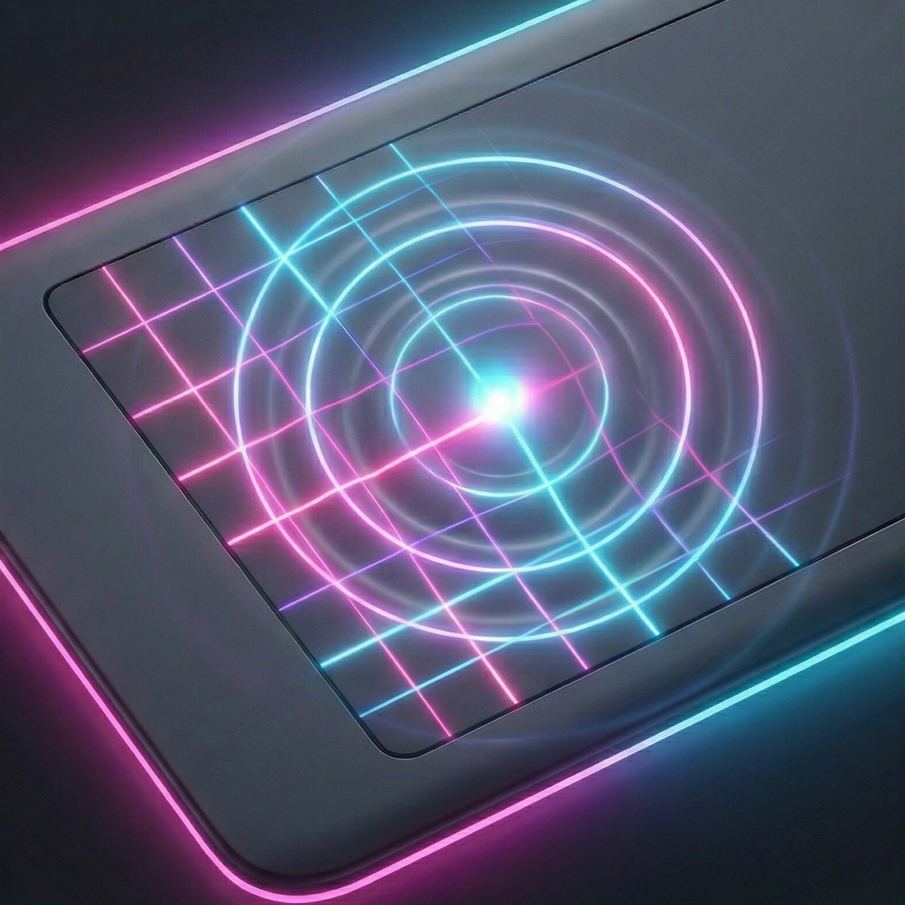

<p align="center">
  
</p>

# Wacom Kaoss Pad

Turn a **Wacom CTH-460** (Bamboo Pen & Touch) into a Kaoss Pad for **Ableton Live**.

Two-finger multitouch XY control with 5 layers switchable via ExpressKeys — no sudo required.

```
Wacom CTH-460 ──USB HID──> kaoss.py ──IAC Driver──> Ableton Live
                           (touch -> MIDI CCs)
```

## Requirements

- macOS (Apple Silicon or Intel)
- Python 3.9+
- Wacom CTH-460 (Bamboo Pen & Touch)
- IAC Driver enabled (Audio MIDI Setup > IAC Driver > Device is online)

## Install

### From source (CLI)

```bash
git clone https://github.com/fedepaj/wacom-kaoss.git
cd wacom-kaoss
python3 -m venv .venv && source .venv/bin/activate
pip install -r requirements.txt
python kaoss.py
```

### macOS Menu Bar App

Download `WacomKaoss.app` from [Releases](https://github.com/fedepaj/wacom-kaoss/releases) and move it to `/Applications/`.

Or build from source:

```bash
./build.sh
cp -r dist/WacomKaoss.app /Applications/
```

> First launch: macOS may show a Gatekeeper warning. Right-click > Open > Open to bypass.

## Mapping in Ableton

1. **Preferences > Link/MIDI > MIDI Ports** — enable **Track** and **Remote** for IAC Driver input
2. Press **Cmd+M** (MIDI Map Mode)
3. Click a parameter (e.g. Auto Filter Frequency)
4. Touch the Wacom — Ableton captures the CC
5. Press **Cmd+M** again to exit mapping mode **before** lifting your finger, otherwise it registers the release CC too

## MIDI CC Reference

5 layers, each with 2 independent XY finger pairs and per-layer gate CCs (127 = touch, 0 = release). Map them to whatever you want.

| Layer | Button | Finger 0 X/Y | Finger 1 X/Y | Gate F0 | Gate F1 |
|-------|--------|--------------|--------------|---------|---------|
| Base  | —      | CC 20/21     | CC 22/23     | CC 30   | CC 31   |
| 1     | btn1   | CC 24/25     | CC 26/27     | CC 42   | CC 43   |
| 2     | btn2   | CC 28/29     | CC 32/33     | CC 44   | CC 45   |
| 3     | btn3   | CC 34/35     | CC 36/37     | CC 46   | CC 47   |
| 4     | btn4   | CC 38/39     | CC 40/41     | CC 48   | CC 49   |

All CCs on MIDI Channel 1. Filter cutoffs (CC 20, 22) use exponential curves for better low-end resolution.

## Features

- **EMA smoothing** — eliminates jitter without adding perceptible latency
- **Grace period** — 400ms tolerance for missed HID reports (no random touch resets)
- **Per-layer gate CCs** — each effect layer has dedicated touch on/off signals
- **Auto-reconnect** — survives USB disconnects, keeps MIDI alive
- **Menu bar app** — status dot overlay (green/yellow/red), no dock icon

## Project structure

```
kaoss.py           Bridge: USB HID -> MIDI CCs (standalone CLI)
app.py             macOS menu bar app (imports Bridge)
build.sh           Build .app bundle (PyInstaller)
requirements.txt   Dependencies
assets/            Icons (icns, ico, png)
```

## License

MIT
